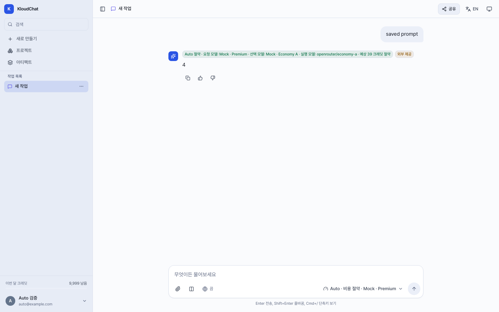
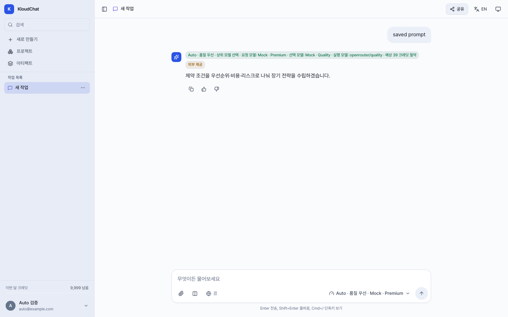
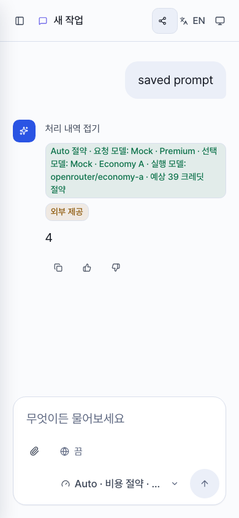
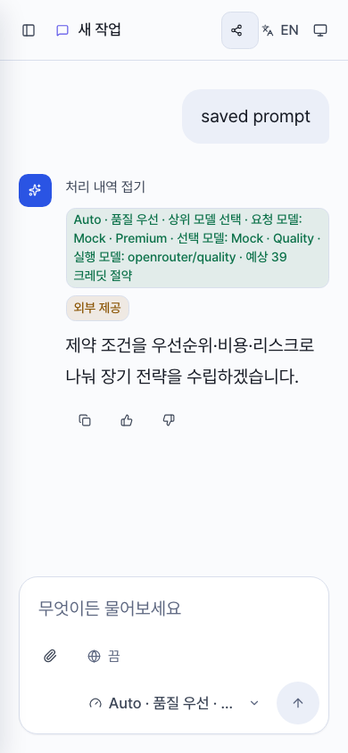
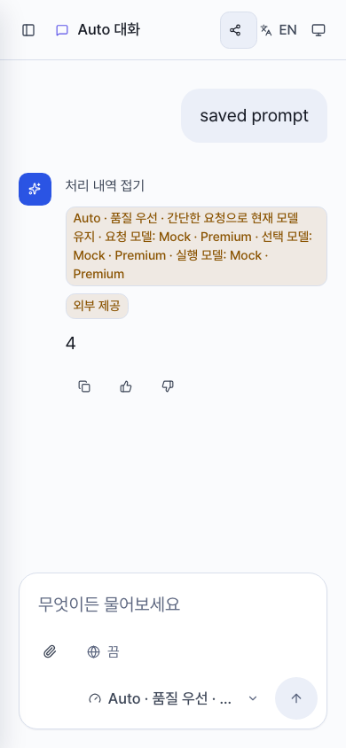
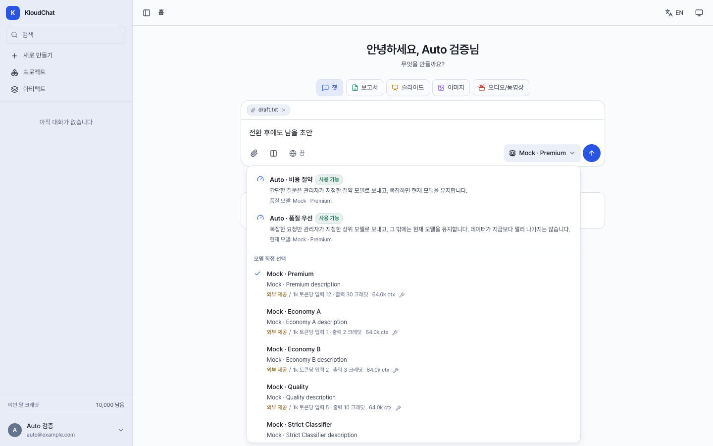
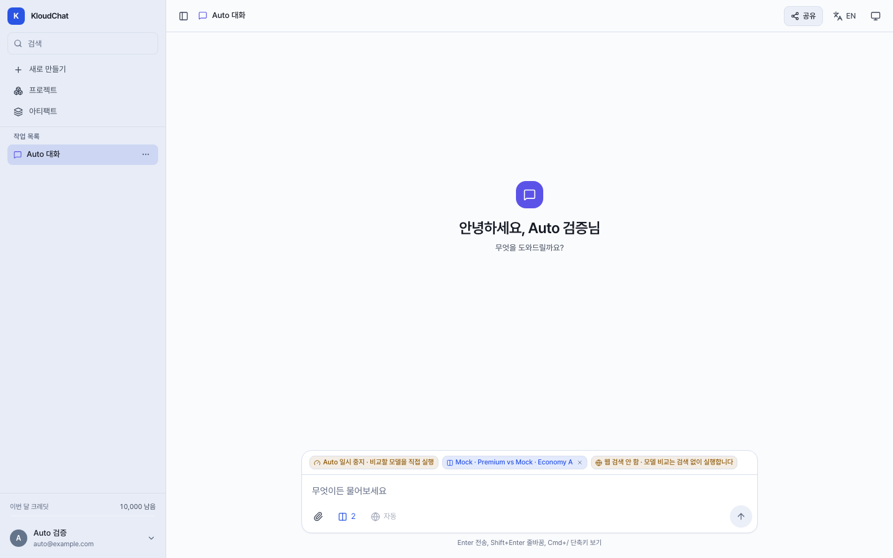
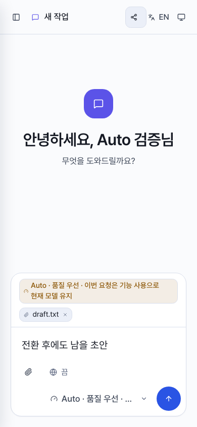

# Auto 모드 UI 검증

## 범위

- 기준 소스는 `db0d4f6aa7567b1404fa7cca2e940ca2079f8a13`임.
- Auto 비용 절약과 품질 우선의 선택, 저장, 전송 대기, 복구, 응답 표시를 검증함.
- Chromium의 1440x900 PC 및 390x844 모바일 화면에서 production preview를 검증함.
- 모든 API 응답과 모델 결과를 Playwright fixture로 제공하고, 등록하지 않은 API 요청은 차단함.
- 실제 모델 호출, 라우팅 품질, 제공자 사용량, 과금은 검증하지 않음. 화면의 모델과 크레딧 값은 모의 데이터임.

## 변경

- 메시지에 기록된 `costRouting.mode`로 절약과 품질 우선 결과를 구분함. 현재 세션 모드가 바뀌어도 이전 응답의 모드는 유지함.
- 품질 상향, 간단한 요청 유지, 상향 후보 없음, 긴 입력, 분류 실패, 기능 우회 등의 이유를 구분함.
- 품질 우선 메뉴에서 기준 모델을 `현재 모델`로 표시함.
- 두 Auto 모드의 기능 우회 및 비교 일시 중지 안내를 지원함.
- 기본 웹 검색 `자동`만으로 모델 유지를 예고하지 않으며, 비교 중에는 우회 미리보기와 충돌하는 안내를 숨김.
- 모바일 처리 내역의 전체 모델 정보와 입력창 안내가 줄바꿈되도록 보정함.
- 품질 우선도 더 저렴한 후보를 선택할 수 있으므로, 서버가 제공한 절약 추정치는 기존대로 표시함.

## 검증 결과

| 실행 | 통과 | 실패 | 제외 |
| --- | ---: | ---: | ---: |
| 기존 테스트 10개, 기준 소스의 production preview | 10 | 0 | 0 |
| 품질 및 반응형 테스트를 확장한 수정 전 검증 | 33 | 25 | 2 |
| 최종 검증: 32개 시나리오 x 2개 화면 | 62 | 0 | 2 |

- 수정 전 검증 이후 검색 미리보기 시나리오 4건을 추가함. 중간 수정본에서 4건 모두 실패를 확인한 뒤 조건을 수정하여 최종 검증에 포함함.
- 모바일은 모델 비교 전환 버튼을 제공하지 않으므로 해당 시나리오 2건을 제외함.
- 신규 세션의 모드 저장 및 새로고침 복원, 생성/PATCH 실패 시 초안 보존, 모드 간 실패 복구, 직접 모델 선택 시 manual 전환을 확인함.
- 설정 PATCH가 완료되기 전에는 전송하지 않고, 완료 후 Enter를 다시 눌렀을 때 한 번만 전송함을 확인함.
- 한국어/영어 결과 표시와 모바일 배지의 실제 텍스트 넘침을 확인함.
- TypeScript 검사와 production build가 통과함. Lint는 기준 소스와 동일한 경고 198건, 오류 0건이며 새 진단이 없음. `git diff --check`가 통과함.
- 독립적인 읽기 전용 기능 검토 후 검색 및 비교 안내 조건을 보완했으며, 해당 변경 재검토에서 추가 지적이 없음.

## 확인 한계

- 개발 모드의 StrictMode에서는 기존 신규 세션 첨부 복원 테스트가 9건 통과, 1건 실패함. 한 번 소비한 복원 상태를 반복 effect가 지우는 현상과 일치하며, 이 문서의 성공 판정은 production preview에 한함. 이 변경에서 해당 복원 로직은 수정하지 않음.
- 서버가 잘못 기록한 과거 메시지의 모드를 프런트엔드에서 현재 세션 모드로 추정하지 않음.
- 빌드의 기존 큰 청크 경고는 유지됨.

## 화면

| 비용 절약 PC | 품질 우선 PC |
| --- | --- |
|  |  |

| 비용 절약 모바일 | 품질 우선 모바일 | 품질 모델 유지 |
| --- | --- | --- |
|  |  |  |

