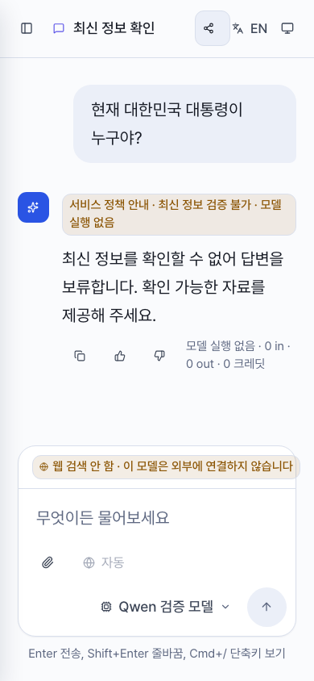
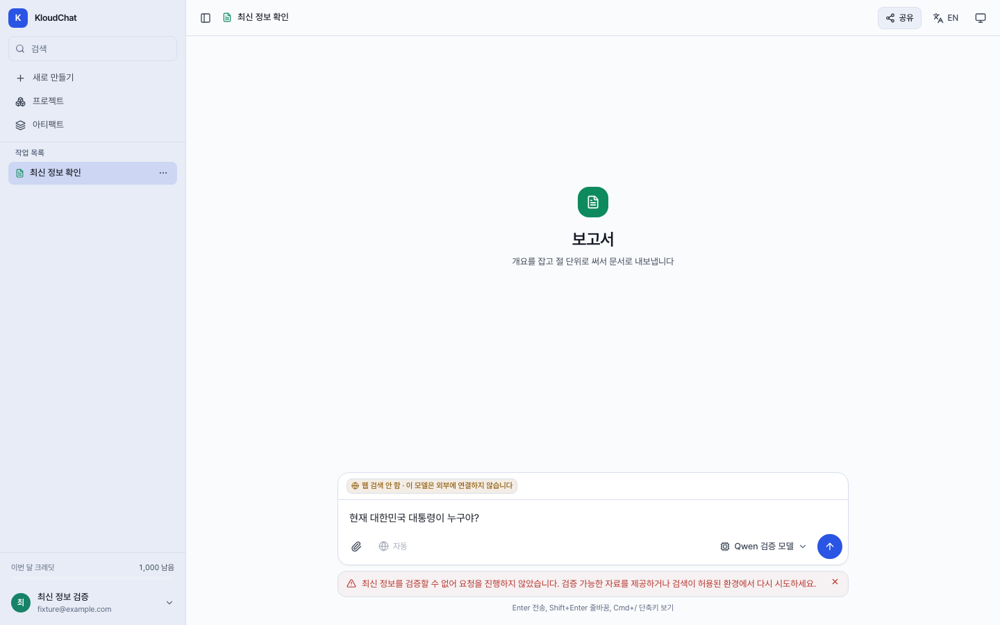

# Current-fact verification boundary

## Purpose and scope

Issue #181 addresses stale political facts being asserted as current, including
local Qwen with search disabled. It does not replace the model or hardcode a current
president, prime minister, date-specific answer, or list of correct answers.

The bounded Korean/English policy recognizes direct officeholder questions and
explicitly current political developments. Stable explanations, historical dates,
quoted translations, supplied-text summaries and clear topic switches have negative
regressions. False means outside this policy, not proven free of hallucination.

## Behavior

- When current-fact verification is unavailable, ordinary chat stores a service
  policy response before key provisioning, Auto classification or generation.
  Search OFF, explicit search refusal, strict-local and Agent tool permissions stay
  authoritative. No external fallback is introduced.
- A stored or streamed policy response has `answerOrigin: server_policy`,
  `model: null` / `actualModel: null`, zero token usage and zero credits. The UI names
  the service policy and no model execution, rather than attributing it to Qwen.
- A short same-question nudge is bound only to contiguous stored service-policy
  holds and their user question in the same session. A model's policy-like prose
  cannot establish this state. New topics and attachment-bearing follow-ups are
  not inferred to be the same question. Repeated nudges retain the original explicit
  search refusal until the current request explicitly asks for research or selects
  search `true`; the current request's own refusal still takes priority.
- A permitted lookup for that nudge reuses the already privacy-processed history
  entry, without copying its raw content into a new prompt or stored metadata.
- When a permitted built-in search is available, the trusted first lookup precedes
  model generation. Failed, empty or structurally unusable results lead to a policy
  response, with no title, memory, artifact or completion settlement.
- `SearchEvidence` is in-process metadata, not parsed from remote result text. A
  usable row needs an absolute HTTP(S) URL and a nonempty snippet or fetched body.
  Invalid URLs are excluded; ordinary search may still return valid link-only rows,
  but those rows cannot release this current-fact gate. Network access remains
  subject to the existing network guard.
- Tool-free comparison and document/slides surfaces refuse recognized current-fact
  requests with HTTP 409 before model generation. Direct and chat-to-document UI
  paths retain the user's draft and show how to recover without enabling search.

Auto audit records retain the original selection reason and explicitly record the
server-policy outcome with no executed model. The UI does not show a selected model
as if it generated an answer when the lookup failed before generation.

Structured source presence does **not** establish that a source is true, recent,
official, relevant or sufficient. Search-enabled factual quality remains a separate
evaluation; an available search tool alone is not evidence of a verified answer.

## Live check

Four frozen synthetic requests used the real API and configured
`strict-local/qwen3.6-35b` route with search OFF. A temporary database contained no
real user messages or connectors. Title generation was explicitly stubbed and
automatic memory disabled. An application transport allowlist restricted the
gateway; this was not an OS firewall or physical-locality attestation.

| Case | Main `2518c2e` | Candidate `9571c86` |
| --- | --- | --- |
| Current Korean president, Korean | Asserted an outdated officeholder | Service abstention, no model call |
| Current Korean prime minister, Korean, no search | Asserted an outdated officeholder | Service abstention, no model call |
| Current Korean president, English, no search | Asserted an outdated officeholder | Service abstention, no model call |
| Translate a quoted current-president question | Correct translation | Correct translation, normal model call |

Baseline used 4 completion requests; candidate used 1 for the translation control.
Both reported zero credit change, zero search calls and zero artifacts. Temporary
database, network, credentials and files were removed, test ports closed, and the
original database contents and stopped state preserved. The three abstentions are
**not three correct factual answers** and do not measure general model accuracy.

The outdated baseline answers were checked on 2026-09-12 KST against the
[presidential office](https://www.president.go.kr/speeches) and the
[prime minister's office dated release](https://www.opm.go.kr/opm/news/press-release.do?article.offset=0&articleLimit=10&articleNo=163478&mode=view).
These references were used for evaluation only, not inserted into product prompts.

## Deterministic checks

- API baseline `2518c2e`: 2,410 passed, 1 skipped. The later `f537972` baseline
  changes the monthly-credit default, not this routing behavior.
- Candidate including follow-up and audit preservation: 2,691 passed, 1 skipped,
  including 281 new API regression cases. Actual socket connections and HTTPX
  network transports were denied in the offline suite; this is not an OS firewall.
- Mock-browser checks: 17 passed, 1 skipped; saved/streamed Korean/English responses,
  both hold reasons, mobile/desktop layouts, direct document/slides/comparison refusal
  and chat-to-document draft restoration. Mobile comparison is skipped because its
  toggle is desktop-only. Four existing routing browser cases also passed.
- Web lint and build passed. Existing lint, generated `phone` CSS selector and
  large-chunk warnings are not attributed to this change.

Screenshots are real Chromium pages with synthetic API/SSE fixtures, not screenshots
of a live provider response.

## Verification limits

Live evidence belongs to its recorded immutable source SHA. Subsequent quoted-input,
source-structure, follow-up and UI changes have separate deterministic regressions;
they must not be represented as having run in that earlier live check.

Other domains, arbitrary paraphrases, attachment-only questions, semantic source
validation and all forms of hallucination remain outside this bounded policy.
Providing a document does not automatically certify its current factual accuracy.
