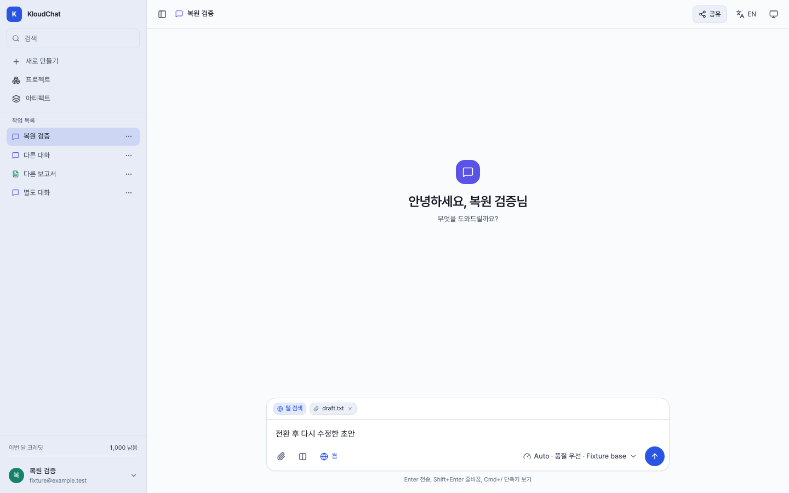
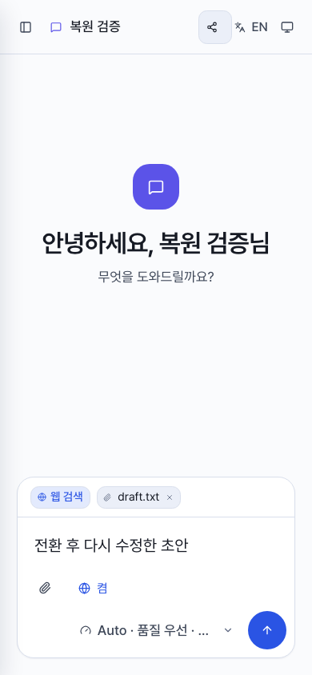

# Auto 선택 후 입력 초안 복원 검증

- 기준: `db0d4f6aa7567b1404fa7cca2e940ca2079f8a13`임.
- React StrictMode에서 일회성 handoff를 복원한 뒤 effect가 재실행되면서 첨부·검색 상태를 초기화하는 문제를 수정함.
- 동일 `sessionId`와 `kind`의 초기화 중복 실행만 막고 다른 대화·종류로 이동할 때의 초기화는 유지함. API·파일 저장·모델 라우터는 변경하지 않음.

## 검증

| 범위 | 수정 전 | 수정 후 |
| --- | --- | --- |
| 개발 모드, 6개 시나리오 x PC/모바일 | 8 실패, 4 통과 | 12 통과 |
| 배포용 빌드, 동일 시나리오 | 이번 비교에서는 미실행 | 12 통과 |
| TypeScript 및 production build | - | 통과 |
| Lint | 경고 198, 오류 0 | 경고 198, 오류 0, 새 진단 0 |

- 두 Auto 모드 x 검색 켬/끔의 새 대화 전환, 재입력 후 첨부 보존, 다른 대화 왕복 시 일회성 handoff 소비, 기존 대화/보고서 전환 시 초기화를 검사함.
- 첫 전환 직후 새 대화 생성 요청 1회와 선택한 모드를 확인함. 파일 업로드까지 포함한 전체 변경 요청이 1회라는 뜻은 아님.
- 모든 API는 합성 응답으로 처리하며 실제 모델·사용자 데이터·외부 Connector를 사용하지 않음. 이 결과는 모델 답변 정확도나 실제 업로드 저장 검증이 아님.
- 개발 서버의 한글 경로 표기 차이로 오래된 모듈을 받은 초기 검사 결과는 폐기하지 않고 로컬 증거에 보존함. 서버를 새로 시작하고 실제 제공된 수정 모듈을 확인한 결과를 위 표에 사용함.
- 큰 번들 경고는 기존 상태로 남음. 별도 PR의 Auto 라우팅 문구 수정과 본 초안 복원 수정은 분리함.

## 화면

수정된 개발 서버와 합성 API에서 첨부·검색 켬·재입력 상태를 확인한 실제 화면임. PC 1440x900, 모바일 390x844이며 폰트 로딩과 화면 전환이 끝난 뒤 캡처함.

