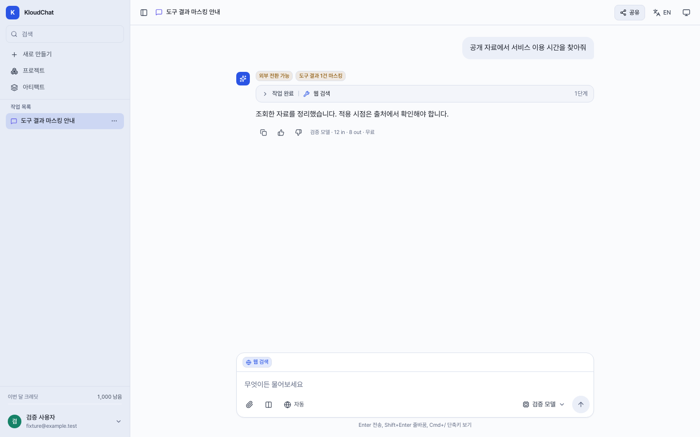

# Search-result masking verification

Base: upstream/main `690f6bb754d8d94e8fb33355815efc6219326384`.

## Problem and scope

The default card detector combines a 13-19 digit candidate with a Luhn checksum.
Some numeric document identifiers and sequences of years accidentally satisfy
that checksum. Separately, a tool-only masking event changes the aggregate
routing action to `mask_external`; the transcript used that action to display
the same badge as a masked user request.

The reported conversation recorded one `payment_card` candidate from tool output
and no input findings. Its original matched value was not recovered. The examples
below are synthetic reproductions, not the original value from that conversation.

## Changes

- In nonlegacy `tool` and `answer` scopes only, preserve an exact, calendar-valid
  14-digit timestamp in an HTTP(S) URL path segment and four consecutive years
  introduced by an explicit English or Korean year label.
- Apply the same filter to masking and finding counts. Known user-protected
  values and nearby card/secret context take precedence over these exceptions.
- Keep input `egress`, legacy broad masking, API keys, government IDs and
  ambiguous card-shaped values under the existing policy. No whole website,
  URL, search result or tool is exempted.
- Render request protection from `initialAction` when available; render actual
  tool masking from `toolOutputMasked`. Explain detected candidates by category
  and count without exposing values or unknown metadata strings.
- Distinguish current input from reference context where source metadata exists.
  Preserve conservative generic wording for old or unknown metadata.
- Keep strict-local detection separate from external masking. Explain that the
  hybrid badge describes catalog configuration, not proof of an external hop.

## Regression evidence

Final offline API suite: **4,035 passed, 1 skipped, 11 warnings**. The network
guard blocked 82 socket attempts and allowed no real HTTP transport. The new
58 pure cases and 4 integration/boundary cases are included in that total, not
additional to it. Ruff also passed.

The new pure regression suite initially had 14 failures and 43 passing controls.
The three initial integration cases also failed before the production change.
Their final fixtures use separate source and secret lines, as the search tool
does, and an additional test preserves conservative masking of inline secret
fields adjoining a URL.

CodeQL identified overlapping whitespace repetitions in the initial year-header
expression. A public `mask()` regression with 100,000 tabs and a checksum-matching
source path exceeded a five-second subprocess limit before the fix. Requiring a
delimiter between the whitespace repetitions removed the overlapping matches.
The final bounded regression checks both `mask()` and `findings()`; no CodeQL
suppression or rule exclusion was added.

| Synthetic input or path | Expected behavior |
| --- | --- |
| `USD/KRW 1,350.50`, rate type and observation time | Preserve; ordinary decimal rates were already unmasked |
| `https://example.test/article/20260912120009` | Preserve exact timestamp path and source reference |
| `Year 2023 2024 2025 2026` | Preserve the labeled consecutive years |
| Public source and synthetic PAN/API key on separate lines | Preserve source; mask both secrets |
| A user-protected contact in the final answer | Continue masking the protected contact at rest |
| Card-like values in query parameters or explicit secret fields | Continue masking |
| `USD/KRW 1350 1360 1370 1384` | Remains conservatively masked as ambiguous card-shaped text |

Integration tests execute the real agent loop and turn-persistence orchestration
with synthetic tools, mocked model streams and an in-memory persistence fake.
They inspect the second model hop, saved answer/steps, routing and value-free audit
metadata. They are not real model, authentication or PostgreSQL end-to-end tests.

The isolated browser configuration mocks API responses and checks saved,
streamed and reloaded messages, disabled streaming, request/tool origins,
strict-local, legacy data, unknown categories and Korean/English labels.
All 13 new browser cases and 209 existing isolated browser cases passed. Web lint,
TypeScript/build, and the 4 config-path tests passed; the production web image
also built successfully with Node 22. The backend-only performance correction
does not change the web code or screenshots.

## Browser evidence

These are actual Chromium renders of **synthetic API fixtures**, not Qwen replies
or evidence that the requested exchange rate was retrieved.

## Limits

This is a narrow false-positive and UI correction, not a general PII recognizer
or a search-result trust policy. Arbitrary identifiers, nonconsecutive numeric
tables and ambiguous values can still be masked. Already persisted masked text
cannot be reconstructed by this change.

Preserving source text does not establish the source's correctness or freshness.
Retrieving a current FX value still requires an appropriate currency pair, rate
type, observation time and source; no current-rate adapter or semantic grounding
verifier was added. No real model completion was used for this patch's regression
verification.
