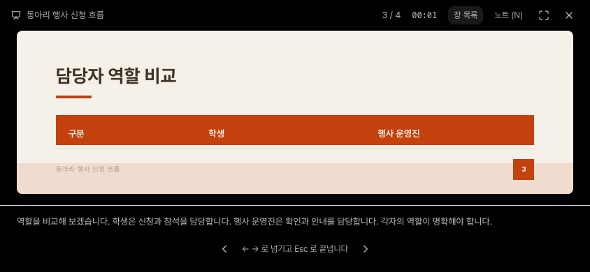
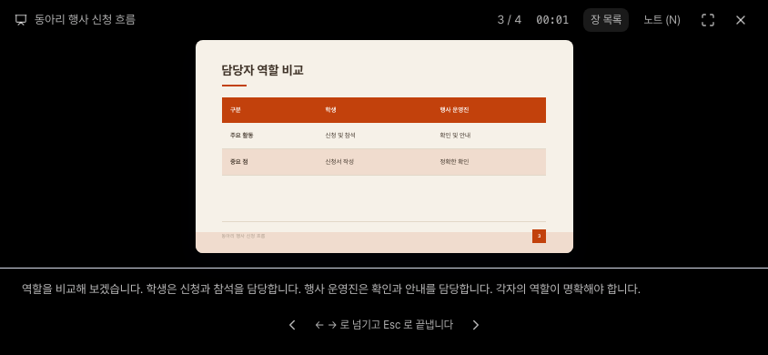

# 슬라이드 발표 영역 검증

## 변경 범위

- JSON 슬라이드 발표 영역에 기존 `useFitWidth`를 적용하여 가용 폭과 높이에 맞는 16:9 화면을 유지함.
- 발표에서만 실제 화면 폭으로 글자와 간격을 함께 축소함. 원본 데이터, 글자 설정, 편집기와 내보내기는 변경하지 않음.
- 공유 `PresentStage`의 콘텐츠 영역에 `min-w-0`만 추가함. HTML 발표의 렌더러와 목록 동작은 변경하지 않음.

## 재현과 결과

- 합성 입력은 `apps/web/e2e/fixtures/presentation-deck.json`의 4장 자료이며, 제목과 본문을 그대로 유지함.
- 844x390에서 3번 표를 발표하면 수정 전에는 두 본문 행이 잘림. 노트를 숨겨도 마지막 행은 잘리고, 전체 화면이나 스크롤로 복구되지 않음.
- 수정 후에는 가용 높이에 맞춰 415x233.44 화면으로 표시하며 표 9칸이 모두 표시됨. 노트 숨김 시 497x279.56으로 확대됨.
- 390x844에서 장 목록을 열었을 때의 54x30.38 화면도 내용 잘림 없이 축소됨. 목록을 닫으면 327x183.94로 복구됨.





## 회귀 실행

```sh
cd apps/web
npx playwright test --config playwright.presentation.config.ts
```

- 390x844, 844x390, 1440x900의 Chromium 화면에서 18개 회귀를 실행함. 최초 기준 `db0d4f6`에서 수정 전 9개 실패/9개 통과, 수정 후 18개 통과함.
- production fixture의 5198 포트와 CI와 같은 개발 모드의 5199 포트에서 각각 18개가 통과함. 전용 설정은 `127.0.0.1:5199`와 `strictPort`, `reuseExistingServer: false`로 기존 서버 재사용을 막음. 사용한 서버와 브라우저는 검사 후 종료함.
- JSON 15개와 HTML 대조군 3개로 구성함. JSON은 노트/목록 켬·끔, 표 9칸의 텍스트 경계, 16:9 비율, 회전, 다음·이전, 목록 이동, 실제 Fullscreen API와 종료를 검사함.
- 화면 크기와 글자 배율의 두 관찰자가 갱신을 마칠 때까지 부모의 가용 영역, 목표 화면 폭, 실제 글자 비례값을 함께 검사함. 3행 fixture의 `tableSize(3) = 16pt / 2.4`를 근거로 각 칸의 글자가 `(16 / 2.4) * 화면 폭 / 400`과 0.01px 이내로 일치한 결과만 최종 측정으로 기록함.
- HTML은 공유 발표 컨트롤, 한 장씩 표시되는 sandbox iframe, 다음·이전·목록 이동, 전체 화면과 종료를 검사함. HTML 자체 레이아웃의 전체 적합성을 보장하는 검사는 아님.
- 모든 브라우저 API 응답은 로컬 mock이며 외부 origin과 외부 WebSocket을 차단함. 개발 모드의 같은 origin Vite 채널만 허용하며 실제 로그인, API, DB, 모델은 호출하지 않음.
- 최초 `db0d4f6` 기준에서는 TypeScript 검사, production 빌드, API 전체 회귀 2,314개 통과/1개 건너뜀, API Ruff와 diff 검사를 완료함. 이 결과는 아래 최신 기준 재검증과 구분한 이력임.
- 웹 린트는 오류 없이 완료함. 기존 경고 198개 중 2개가 줄어 196개가 남으며 새 발표 코드와 회귀에는 새 경고가 없음.

## 최신 기준 재검증

- 2026-09-08 main `80bf253` 위에 반영한 `5a075cb`에서 재검증함. 최초 수정 커밋과 발표 제품 코드, fixture, 회귀 및 전용 설정의 내용이 동일함을 확인함.
- 원래 Vite 설정을 유지한 production fixture와 CI와 같은 개발 모드에서 각각 18개가 통과함. TypeScript 검사, production 빌드, Vite 경로 회귀 4개도 통과하며 웹 린트는 경고 196개/오류 0개임.
- 같은 `5a075cb`의 별도 API 전체 회귀는 2,372개 통과/1개 건너뜀, 경고 11개, 11.50초이며 API Ruff와 diff 검사도 통과함. API 회귀는 네트워크 전송을 차단한 mock 검사로 실제 서비스나 모델 검증이 아님.
- 이 문서 갱신은 검증 이력만 추가하며 제품 코드와 회귀 기대값을 변경하지 않음. 검사에 사용한 5198/5199 서버와 브라우저를 모두 종료함.

## 남은 제한

- 작은 화면에 전체 16:9 슬라이드를 맞추는 정책은 유지함. 세로 화면의 장 목록 열림에서는 표 글자가 0.90px로 매우 작으며, 이 결과를 읽기 품질 통과로 간주하지 않음. 목록을 닫는 기존 복귀 경로를 유지함.
- 가로 화면의 표 글자는 노트 켬에서 약 6.92px로 축소됨. 이번 수정은 내용 잘림 해소이며 확대 도구나 모바일 메뉴 재설계가 아님.
- 실제 모바일 기기와 Safari는 검사하지 않음. 화면 회전과 전체 화면 검사는 Chromium의 실제 DOM/Fullscreen API를 이용한 로컬 fixture 결과임.
